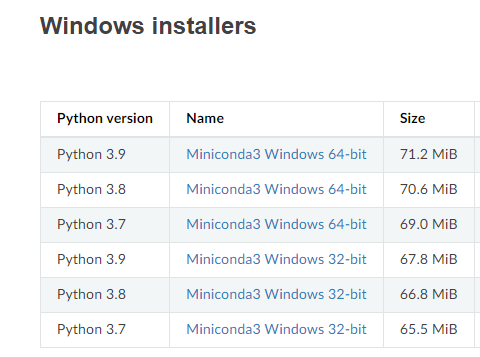

---
# 부스트 캠프 1주차 Python 정리
---

1주차에 진행된 Python 강의를 정리해보려고 합니다.

알고 있는 내용이더라도 정리하는 습관을 들이기 위해서!
<br><br>

## 0. 파이썬 코딩 환경

저는 `윈도우`를 사용해서 최종적으로 `miniconda` + `vscode` / `jupyter notebook`을 사용하기로 했습니다.

요즘 `vscode`는 확장프로그램으로 `jupyter notebook`도 지원해서 굳이 설치 안해도 될거 같더라고요.

```
설치 주소

https://docs.conda.io/en/latest/miniconda.html
https://code.visualstudio.com/
```


| installed| version |
|:---------|:--------|
|miniconda | 4.14.0  |
| Python   | 3.9.12  |
| vscode   | 1.71.2  |


`miniconda`를 설치할때 `Windows Installer`를 보시면 `Python version`이 적혀 있습니다. 저는 그냥 최신꺼 설치했는데 강의에서는 `Python 3.8`로 권장했습니다.


 {:style="border:1px solid #eaeaea; border-radius: 7px; padding: 0px;" }


`miniconda`나 `vscode` 설치할때  `Path` 옵션 설정해두시는게 편합니다. 저는 안했다가 윈도우 환경변수 설정에 추가했습니다.

`vscode`를 킬때 꼭 `miniconda` 실행 후 작업 주소에서


```cmd
(base) [작업 주소]>code .
```


으로 진행해주시기 바랍니다. 아니면 `Python` 따로 설치하라고 뜹니다!


## 1.